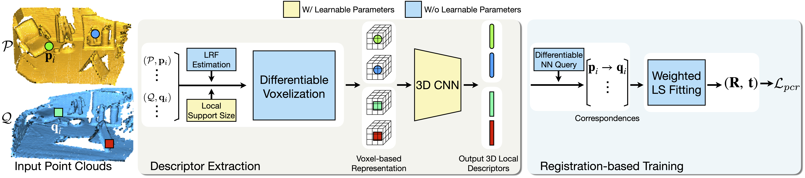

# WSDesc: Weakly Supervised 3D Local Descriptor Learning for Point Cloud Registration

By Lei Li, Hongbo Fu, Maks Ovsjanikov. (IEEE TVCG)


In this work, we present a novel method called WSDesc to learn 3D local descriptors in a weakly supervised manner for robust point cloud registration. Our work builds upon recent 3D CNN-based descriptor extractors, which leverage a voxel-based representation to parameterize local geometry of 3D points. Instead of using a predefined fixed-size local support in voxelization, we propose to learn the optimal support in a data-driven manner. To this end, we design a novel differentiable voxelization layer that can back-propagate the gradient to the support size optimization. To train the extracted descriptors, we propose a novel registration loss based on the deviation from rigidity of 3D transformations, and the loss is weakly supervised by the prior knowledge that the input point clouds have partial overlap, without requiring ground-truth alignment information. Through extensive experiments, we show that our learned descriptors yield superior performance on existing geometric registration benchmarks.




## Link

[Paper](https://arxiv.org/pdf/2108.02740.pdf)


## Citation
```
@article{Li_2022_WSDesc,
    title = {{WSDesc}: Weakly Supervised 3D Local Descriptor Learning for Point Cloud Registration},
    author = {Li, Lei and Fu, Hongbo and Ovsjanikov, Maks},
    journal = {IEEE Transactions on Visualization and Computer Graphics},
    year = {2022},
    volume = {},
    pages = {1--1},
    doi = {10.1109/TVCG.2022.3160005},
}
```


## Instructions

For the 3DMatch dataset, please check the branch `main`.

### Dependencies

The code was developed on Ubuntu with 
- CUDA 11
- Python 3.7
- Pytorch 1.7.1
- [torch-cluster](https://github.com/rusty1s/pytorch_cluster) 1.5.9

Other used Python packages are listed in `requirements.txt`.
It is preferable to create a new conda environment for installing the packages.


### Training \& Evaluation

Start training by running `python train.py`.
The data should be automatically downloaded, and the differentiable voxelization module should be automatically compiled and loaded.

A copy of the pretrained weights is provided in `exp/modelnet40_pretrained`.

To use the pretrained weights for testing, run `python test.py --ckpt exp/modelnet40_pretrained/modelnet40.ckpt`


## References

1. Wang and Solomon. [PRNet: Self-Supervised Learning for Partial-to-Partial Registration](https://github.com/WangYueFt/prnet). NeurIPS 2019.
1. Gojcic et al. [The Perfect Match: 3D Point Cloud Matching with Smoothed Densities](https://github.com/zgojcic/3DSmoothNet). CVPR 2019.
1. Li et al. [End-to-end learning local multi-view descriptors for 3d point clouds](https://github.com/craigleili/3DLocalMultiViewDesc). CVPR 2020.


[](http://creativecommons.org/licenses/by-nc/4.0/)

This work is licensed under a [Creative Commons Attribution-NonCommercial 4.0 International License](http://creativecommons.org/licenses/by-nc/4.0/).
